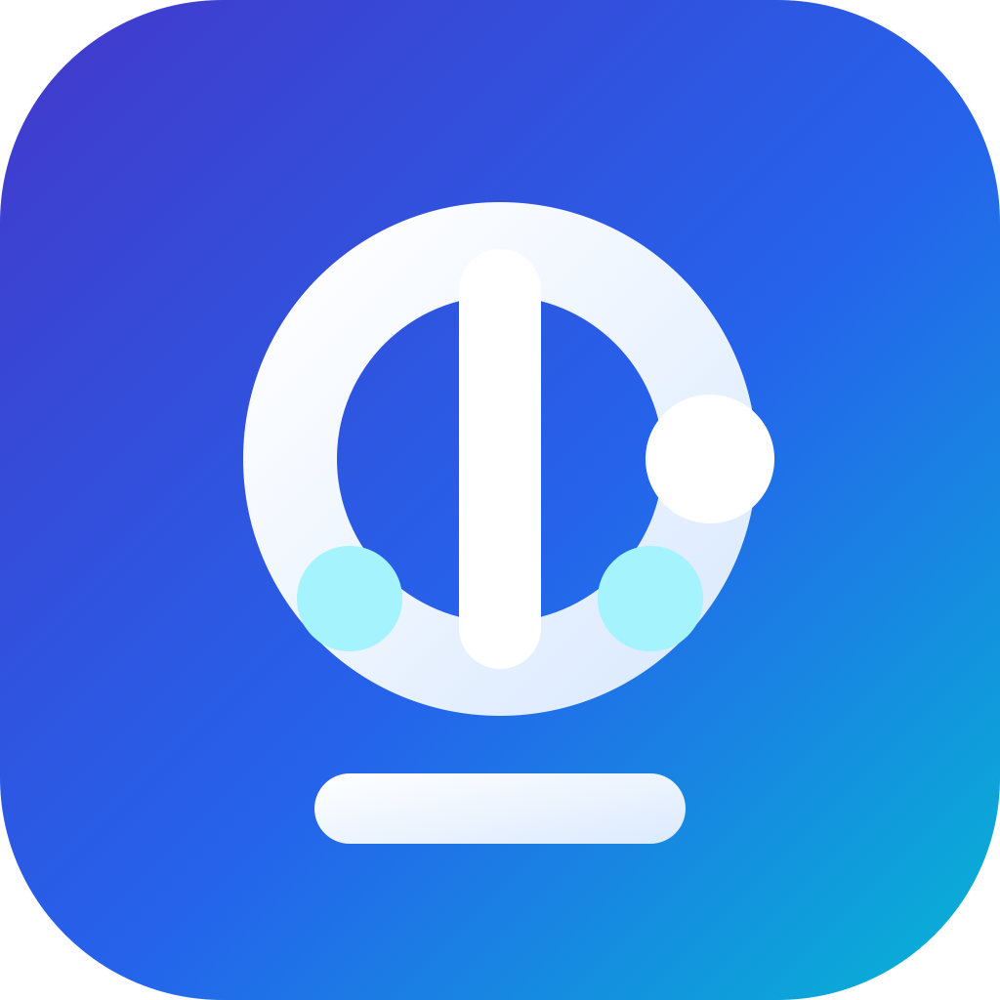

<p align="center">
  
</p>

<h1 align="center">DSH for macOS</h1>

<p align="center">
  A native SwiftUI client for <a href="https://github.com/deepseek-ai/deepseek-harness">DeepSeek Harness</a>, speaking the harness <code>/api</code> gateway directly. No web view.
</p>

<p align="center">
  Streaming, attachments, multiple concurrent chats, and OpenAI-compatible providers (vLLM, Ollama, LM Studio, or any gateway).
</p>

---

## Download

Grab the latest build from [Releases](https://github.com/gnubyte/deepharness/releases). The `.dmg` contains the app — drag **DSH** into **Applications**.

> **Note:** releases are ad-hoc-signed for Apple Silicon (arm64), macOS 14+. Gatekeeper will prompt on first launch — right-click the app and choose **Open**, or run:
>
> ```bash
> xattr -d com.apple.quarantine /Applications/DSH.app
> ```

## Build

```bash
./bundle.sh release
open build/DSH.app
```

Requires Swift 6 / Xcode 26 and macOS 14+.

## Run

The app needs a harness to talk to. Either:

- **Attach to a running server** — start `pnpm dsh web` yourself and enter its URL, or
- **Start one from a checkout** — point the app at a `deepseek-harness` directory and it launches `dsh web` as a child process, bound to the app's lifetime.

## Why `/api` and not ACP

The repo ships an [ACP](https://agentclientprotocol.com) server, which looks like the obvious integration seam and is the wrong one for a chat client. Its own contract rules it out:

> **Committed answers only** — live progress, reasoning, tool activity, plans, titles, and usage stay off the wire.

> **Fresh sessions only** — load, list, resume, delete, and fork are unsupported.

That is no streaming and no multichat. ACP is explicitly *"a transport adapter, not a UI integration"* — it states that interactive rendering belongs to the web host.

`packages/host/apiproxy` is the seam that does: *"the API gateway shared by every client"*, deliberately transport-independent, with `AbstractApiClient` + platform subclasses as the documented extension point. Electron already rides it over an IPC bridge instead of HTTP. This client is another carrier on the same contract.

## Architecture

```
DSHKit/                    transport + contract — no AppKit, headlessly testable
  JSONValue.swift          dynamic JSON (the contract spans 36 domains and moves)
  RPC.swift                four-quadrant envelopes, business vs carrier errors
  APIClient.swift          POST /api/<method>, payload-direct domain methods
  EventStream.swift        reconnecting WebSocket for the mux/host streams
  Transcript.swift         folds session events into renderable items
  Attachment.swift         staged images, raster vocabulary

DSHMacApp/                 SwiftUI
  AppModel.swift           sessions, streams, provider topology
  ConversationView.swift   transcript, streaming, composer, attachments
  ProvidersView.swift      OpenAI-compatible endpoint configuration
  HarnessProcess.swift     child-process supervision

dshprobe/                  headless CLI that drives DSHKit against a live harness
```

`DSHKit` has no UI dependency, so the protocol layer is verifiable on its own:

```bash
swift build && ./.build/debug/dshprobe
```

### Why the transport layer stays dynamic

Every payload decodes through `JSONValue` rather than 36 domains of static structs. The repo warns *"THERE WILL BE COMPATIBILITY-BREAKING CHANGES"* — a static mirror would break on any field addition upstream. Each view reads exactly the fields it renders, and unknown event types are ignored rather than fatal.

## Wire notes

Shapes that cost time to discover, all verified against a live harness:

| Thing | Shape |
|---|---|
| Unary call | `POST /api/<method>`, body `{type:"client-request", rpcId, method, payload}` |
| Response | Always HTTP 200 for business outcomes; `{result:{ok:true,value}}` or `{result:{ok:false,error}}`. Status codes describe only the carrier. |
| Streams | `ws://…/api/events.mux` and `/api/events.host`; frames arrive as `{type:"server-request", rpcId, method, payload}` |
| Streaming chunks | `block-start` → `text-delta`×N → `block-end` → `usage` → `finish` |
| `assistant/message` | content nests under `data.message` |
| `user/message` | content sits directly on `data`, and `source.kind` distinguishes a human prompt from runtime context injections (`plugin`, `agent-instructions`, `skill-catalog`) |
| `tool/call` | `data.arguments` is a JSON **string**, not an object |
| `tool/result` | nests under `data.message.content[]` as `tool-result` blocks; carries no tool name, so correlate on `callId` |
| `session.history` | wraps each event as `{event: …}`; the mux stream does not |
| Attachments in | `session.prompt` content block `{type:"image", mediaType, data: <base64>, name}` |
| Attachments out | `session.attachment` reads a durable image the log references |
| Reconnect | `since` is unimplemented upstream — recovery is reopen + refetch history |
| **Session titles** | there is **no** `title` field on a session summary — titles ride `projections.values.title`, seeded from the list/history `projections` block and updated by `session/projection` frames (higher-seq-wins) |
| Answering the agent | approvals and questions are *answerable* server-requests: `POST /api/respond` with `{type:"client-response", rpcId, result:{ok:true,value}}`, echoing the frame's rpcId. The body is an `RpcReceipt`, not a business result; a stale answer returns `{accepted:false, reason:"not-pending"}` rather than an error |
| Approval answer | `{sessionId, approvalId, outcome: "allowed-once" \| "rejected"}` — the other outcomes are host-side only |
| Question answer | `{sessionId, answer:{answers:[{id, selected[], custom?}]}}` — one ask is answered as a whole batch, never per question |
| `session/queue` | complete authoritative snapshot on every change; `placement` is `queued` (dock), `steering` (conversation tail), or `context` (never shown) |
| `subagent.list` | rows are `kind:"child"` (with `mode`, `activity`, `hasChildren`) or `kind:"diagnostic"` (with `reason`) |

## Providers

Any OpenAI-compatible endpoint is configuration, not code. The harness's `llm-pi-ai` adapter treats a route it doesn't ship as hand-declared:

> an OpenAI-compatible gateway, a self-hosted server, or a provider newer than the installed catalog is configuration rather than a code change

Settings → **Add OpenAI-compatible endpoint** writes that route: pick a preset (Ollama / vLLM / LM Studio), hit **Discover models** to interrogate the endpoint via `llm.discoverModels`, and save. 37 catalog routes (`openai`, `anthropic`, `groq`, `openrouter`, `together`, …) are also available.

Two things worth knowing:

- **pi-ai requires a credential reference even for keyless local servers.** Without one the turn fails with `No API key for provider`. The app stores a placeholder automatically for local endpoints.
- **Declare image input explicitly.** A route's models default to `[text]`, so a vision model needs `input: ["text","image"]` or the prompt is refused before upload with `MODEL_DOES_NOT_SUPPORT_IMAGES`.

## Project folders

Hand the agent a whole folder to work in: **File ▸ Open Project Folder… (⌘O)**.

The folder is adopted as a workspace and a chat opens inside it, so every file operation the agent performs resolves against that directory. The folder is shown in the toolbar of every chat, with Reveal in Finder and Copy Path. New chats (⌘N) stay in the project you are already working in, and re-opening a folder you have used before returns to its most recent chat rather than piling up empty ones.

Two consequences worth knowing:

- **The directory must already exist.** `workspace.create` adopts a directory and never makes one, so the picker does not offer folder creation.
- **The project folder is also the permission boundary.** Under the default `workspace-write` preset, writes inside it proceed; a write outside it triggers an approval prompt asking to escalate to `danger-full-access`.

## Context and token usage

The gauge in the toolbar shows how full the model's context window is. Its popover breaks that down into system / tools / messages, plus remaining and projected tokens, cumulative session input and output (cache reads and writes separately), turns, steps, decode speed, and time to first token.

None of it is derived client-side — the harness computes it and pushes `contextPressure`, `contextBreakdown`, `tokenUsage`, and `sessionStats` as projections.

## Permissions and full access

The shield menu shows the preset this chat runs under and sets the preset **new** chats start with. Granting full access asks for explicit confirmation and then opens a new chat, because:

- **A chat pins its permissions when it is created.** The harness's own `/permissionPresets` command is the only live switch.
- **This deployment does not dispatch slash commands.** A `/nonsense-xyz` prompt returns `{accepted: true}` rather than the contract's `unknown-command` error, so every leading-`/` prompt reaches the model as plain text. Writing `permission.defaultPreset` through `settings.update` is therefore the only working path, and it applies at session creation.

Under full access the agent runs shell commands and executables and reads and writes files anywhere your user account can reach, without asking. A red banner stays visible for the whole chat while it is on.

## Prompt history

Every prompt you send is recorded to a local SQLite database at:

```
~/Library/Application Support/DSH/prompts.db
```

⌘Y opens the browser — scoped to the current chat or across all of them, searchable, with **Use Again** dropping a past prompt back into the composer to edit before resending.

This is the client's own record and is deliberately independent of the harness: session logs live in `DSH_HOME` and can be compacted, rotated, or deleted, whereas this survives all of that. It stores only what you typed — never model output, never attachment bytes. Control commands the app sends on your behalf are not recorded.

## Produced files

When a turn creates or modifies files, they appear as chips beneath it. Click to open, or use the menu for Reveal in Finder / Copy Path.

Following the harness's own rule, a mutation is recognised by *render intent* rather than tool name — a diff card, or a generic card declaring `kind: "edit"` — so a new mutation tool joins automatically. Reads carry `locations` too and are excluded; failed and cancelled calls contribute nothing; a path appears once per turn in first-seen order.

## Stopping an agent

A running agent is reachable from four places, none of which require having its chat open:

- **The running bar** at the top of the sidebar — appears whenever anything is running, shows the count, and offers Stop / Stop All. Clicking the label jumps to a running chat.
- **The chat's own row** in the sidebar — a red stop button while it runs, plus Stop Agent / Stop Subagents in its context menu.
- **The toolbar** of the open chat, which reads "Stopping…" and disables itself once a cancel is in flight.
- **Session ▸ Stop Turn (⌘.) / Stop All Agents (⇧⌘.)**.

Running chats sort to the top of the ungrouped list, so a freshly started agent is never buried.

Two behaviours worth knowing, both verified against a live harness:

- **Stopping halts queued work too.** A session with three queued prompts, cancelled mid-turn, recorded exactly one `turn/start` and ended `{"kind":"aborted","reason":{"kind":"user"}}`. The remaining prompts did not resume.
- **Cancelling a parent does not reach its subagents.** They have their own interrupt path, so a parent that looks stopped can still have work underneath — hence the separate Stop Subagents action.

**Session ▸ Harness Recovery…** (also the stethoscope in the connection bar) handles the case where the harness itself, not one turn, is the problem: stop all agents, reconnect, or restart the process. Restart is offered only for a harness this app started; one launched elsewhere says so rather than showing a button that does nothing.

## Memory and skills

**Session ▸ Memory & Skills… (⇧⌘M)** manages both for the current project.

### Memory

Memory is files inside the project, so the agent reads and edits it with the tools it already has and it diffs like anything else in the repo:

| Path | Lifetime | Loaded |
|---|---|---|
| `MEMORY.md` | durable | every session |
| `memory/YYYY-MM-DD.md` | one day | on demand |
| `.agents/skills/memory/SKILL.md` | durable | when the task calls for it |

**Set Up Memory** creates all three. The editor shows a line count and warns past ~100 lines, because `MEMORY.md` costs tokens on every request — detail belongs in a skill, and today's state belongs in a daily log.

**How injection actually works.** The harness's `agent-instructions` loader accepts an `instructionFileCandidates` config, and `dsh --profile web --dump-config` shows `MEMORY.md` applied to it — but the running harness ignores it. Verified: in a project root where `AGENTS.md` loads 16 KiB of instructions, a `MEMORY.md` beside it loads nothing. So the app mirrors `MEMORY.md` into a managed block of `AGENTS.md`, delimited by `<!-- dsh:memory:start -->` / `<!-- dsh:memory:end -->`. Anything outside those markers is untouched, so hand-written instructions survive. Confirmed end-to-end: a canary written to `MEMORY.md` appears in the model's `agent-instructions` context.

**A project folder needs a root marker.** `agent-instructions` finds the project root by walking up for `.git`, and with no root it loads nothing at all — not even `AGENTS.md`. A folder that is not a git repository gets no instructions and no memory.

### Skills

Skills already work in the harness — `skill-filesystem` scans project and user roots for `SKILL.md` and watches them for changes. The app surfaces that catalog and lets you author into it.

Discovery roots, highest precedence first:

| Rank | Path |
|---|---|
| 100 | `<project>/.dsh/skills` |
| 200 | `<project>/.agents/skills` |
| 400 | `$DSH_HOME/skills` |
| 500 | `$DSH_AGENTS_HOME/skills` |

**New Skill** writes to rank 200. The `description` frontmatter is the only thing the model sees before loading, so it should state *when* the skill applies rather than what it contains.

## Enabling session search

Search is **off by default**: the base bundle ships `session-query-sqlite` with `openAt: never`, and every search fails with `SESSION_QUERY_SEARCH_DISABLED`. The bundle names the profile patch layer as the place to opt in. In `$DSH_HOME/profiles/<profile>/cordis.patch.yml`:

```yaml
- id: session-query-sqlite
  config:
    path: ./session-index.db
    openAt: first-search
```

That is necessary but not sufficient — **the harness must also run on Node 24**. Node 23's bundled `node:sqlite` has no FTS5, so the index fails to open with `no such module: fts5`. The app reports both cases rather than showing a false "no matches".

## Status

Verified against a live harness with a local Ollama endpoint:

- Connection, session list/create/switch/rename, history hydration, fork
- Token-level streaming; tool call and tool result rendering; error surfacing
- Markdown: headings, fenced code with copy, lists, quotes, inline styles — including an unterminated fence while a response is still streaming
- Image attachment upload (accepted and committed to the durable log as a verified reference)
- Provider discovery against a live OpenAI-compatible endpoint
- **Approvals** — a real escalation request rendered, and rejecting it produced `write: Error: the user rejected escalating this operation to "danger-full-access"` from the harness
- **Queue dock** — three queued messages, with remove verified against the authoritative snapshot
- **Steering** — renders at the conversation tail, distinct from the dock
- **Workspaces** — create/rename/list, with grouped and ungrouped sidebar sections
- **Search** — live results with snippets, after the two fixes above
- **Subagent inspector** — catalog reads, one-shot vs continuable
- **Project folders** — opening a folder created a chat in it, and the agent's `write` landed at `<project>/notes.md` with no escalation prompt, confirming the cwd is real
- **Context meter** — live gauge and breakdown against a real 32k-window session
- **Permissions** — setting the default to `danger-full-access` produced a new session pinned to it while the existing session kept `workspace-write`, exactly as the plugin documents
- **Prompt history** — a prompt sent through the app landed in `~/Library/Application Support/DSH/prompts.db` with its session, cwd, and mode
- **Produced files** — a turn with one successful and two failed writes showed exactly one chip
- **Stopping** — Stop All cleared two background agents; a per-row stop halted a third without ever selecting it, and its two queued prompts never started

48 tests over captured wire shapes and regression cases: `swift test`.

### Known gaps

- **Full access cannot be turned on for a chat that already exists** — permissions pin at creation and this deployment dispatches no slash commands, so the grant opens a new chat instead. A deployment that mounts the command registry could switch in place via `/permissionPresets`.

- **User questions are built but were never triggered live.** No locally-runnable model reliably called `ask_user_question`; the decode and answer paths are covered by tests against the documented shape, and share the `/api/respond` path that approvals exercised end-to-end.
- **Subagent prompting is untested against a real child** for the same reason — nothing local spawned one.
- Reasoning blocks render as ordinary assistant text; the harness distinguishes them but no local model emitted any.
- No plan, goal, or trajectory surfaces.
