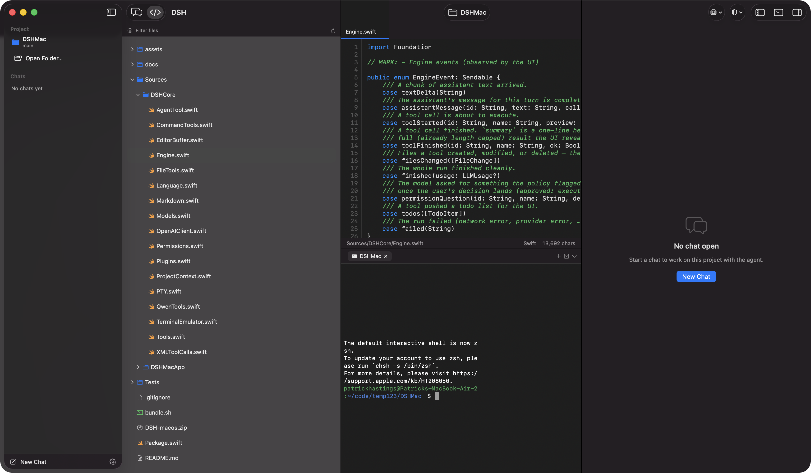

<p align="center">
  
</p>

<h1 align="center">DSH for macOS</h1>

<p align="center">
  A native SwiftUI coding agent that <em>is</em> the harness. It runs the tool loop itself and talks
  straight to an OpenAI-compatible model server — a DGX Spark on your LAN, a local Ollama or
  LM Studio, or a hosted provider. No Node, no sidecar process, no web view.
</p>

<p align="center">
  
</p>

---

## What it is

This started as a client for [DeepSeek Harness](https://github.com/deepseek-ai/deepseek-harness),
driving an external `dsh web` process over its `/api` gateway. That is gone. The app now owns the
agent loop end to end:

```
you → DSHCore.Engine → OpenAI-compatible /chat/completions → tool calls → files & shell → you
```

The practical difference is that there is nothing to install alongside it and nothing to keep
running. Point it at a model and open a folder.

## Download

Grab the latest build from [Releases](https://github.com/gnubyte/deepharness/releases). The `.dmg`
contains the app — drag **DSH** into **Applications**.

> Releases are ad-hoc-signed for Apple Silicon (arm64), macOS 14+. Gatekeeper will prompt on first
> launch — right-click the app and choose **Open**, or run:
>
> ```bash
> xattr -d com.apple.quarantine /Applications/DSH.app
> ```

## Build

```bash
./bundle.sh release
open build/DSH.app
```

Requires Swift 6 / Xcode 26 and macOS 14+.

## First run

The setup wizard runs on first launch and is re-runnable any time from **Settings ▸ Run Again…** or
**Help ▸ Run Setup Wizard…**. Seven steps: pick a backend, enter its address, prove the connection
works, choose a model, pin a permission preset, and optionally open a project.

### Pointing it at a DGX Spark

Following the [DGX Spark AI setup guide](https://github.com/phastings503cm/dgx-spark-wizard), the box
serves an OpenAI-compatible API over your LAN. In the wizard choose **DGX Spark or another server on
your network** and give it the host and port:

| Field | Value |
|---|---|
| Address | the Spark's hostname or LAN IP (`spark.local`, `192.168.1.50`, …) |
| Port | `8002` for the guide's serving stack |
| URL | built for you as `http://<address>:<port>/v1` |

**Test Connection** calls `GET /v1/models`. If it succeeds the model list populates the next step; if
it fails you get the actual error plus the thing that is usually wrong — a server bound to `127.0.0.1`
instead of `0.0.0.0` is invisible from another machine.

The same step handles Ollama (`127.0.0.1:11434`), LM Studio (`127.0.0.1:1234`), OpenAI, and
OpenRouter. API keys go to your login keychain, never into the preferences file.

An agent needs a model that can call tools. Qwen3, Qwen2.5-Coder, and DeepSeek-V3-class models work;
very small models will flail.

## Tools

The tool set matches [Qwen Code](https://qwenlm.github.io/qwen-code-docs/en/developers/tools/introduction/)
name for name, so prompts, skills, and habits from that ecosystem carry over:

| Tool | What it does |
|---|---|
| `read_file` | read a text file, with line numbers |
| `read_many_files` | read a batch in one call |
| `write_file` | create or replace a file |
| `edit` | replace an exact string inside a file |
| `list_directory` | list one directory |
| `glob` | find files by pattern (`**/*.swift`) |
| `grep` | search file contents |
| `run_shell_command` | run a command in the project folder |
| `web_fetch` | fetch a URL as text |
| `todo_write` | publish a task list the UI renders |
| `exit_plan_mode` | hand back a plan instead of doing the work |
| `agent` | spawn a subagent for a scoped task |

**Models without function calling still work.** Many Qwen-class models on Ollama or older vLLM emit
tool calls as XML inside plain text instead of `tool_calls`. When a turn finishes with no native
calls, the text is run through an XML parser that understands both the `<function=…>` and
`<tool_name>…` conventions, and the recovered calls execute normally.

## Code mode

**⌘2** switches the window from chat to a VS Code-shaped workspace, with the agent in the panel:

- **Project tree** — lazy, filterable, FSEvents-backed. New files from a build or from the agent show
  up without a refresh. Right-click for reveal, rename, new file/folder, trash, open a terminal here,
  or drop the path into the chat composer as `@path`.
- **Editor** — tabbed `NSTextView` with a line-number gutter, soft tabs, indent-preserving newlines,
  find bar, and a syntax highlighter covering the usual languages. Highlighting is scoped to the
  visible range, so a 20 000-line file opens as fast as a short one.
- **Live reload** — when the agent rewrites a file you have open, a clean buffer just follows it. A
  buffer with unsaved edits never gets overwritten: it raises a bar offering **Reload from Disk** or
  **Keep Mine**.
- **Terminal** — a real login shell on a pty (`forkpty`, so job control and Ctrl-C work), with a
  VT100/xterm-subset emulator: colour including 256 and truecolor, scroll regions, the alternate
  screen, and OSC titles. Multiple tabs, each rooted where you opened it. **⌃`** toggles the panel.

Open tabs, the terminal panel, and the tree's visibility are remembered per project.

## Chat

The transcript interleaves messages and tool calls in the order they happened — a tool card renders
between the text that preceded it and the text that followed, expandable to its full output. Markdown
renders with headings, fenced code (with copy), lists, task lists, quotes, and tables, including an
unterminated fence while a response is still streaming.

The composer sends on ↩ and inserts a newline on ⇧↩. Files the turn touched appear as chips that jump
straight to the editor.

## Memory and skills

**Session ▸ Memory & Skills… (⇧⌘M)**.

Because this app assembles the prompt itself, instruction files are simply read and injected — no
mirroring into `AGENTS.md`, no managed marker blocks. Any of these in the project root is loaded on
every turn, in order:

`AGENTS.md` · `QWEN.md` · `CLAUDE.md` · `DSH.md` · `MEMORY.md` · `memory/YYYY-MM-DD.md`

**Set Up Memory** scaffolds `MEMORY.md` plus today's daily log. The editor warns past ~100 lines,
because that file costs tokens on every request — detail belongs in a skill.

Skills are a folder with a `SKILL.md` whose frontmatter says *when* it applies. Discovery roots, in
precedence order:

| Rank | Path |
|---|---|
| 100 | `<project>/.dsh/skills` |
| 200 | `<project>/.agents/skills` |
| 300 | `<project>/.qwen/skills` |
| 400 | `~/Library/Application Support/DSHMac/skills` |

Only the name and description reach the model up front; it reads the file with `read_file` when a
task matches. The **System prompt** tab shows exactly what gets sent.

## Plugins

A plugin is a JSON manifest that declares extra tools backed by shell commands. No compilation, no
process protocol — drop a file in `~/Library/Application Support/DSHMac/plugins/` or
`<project>/.dsh/plugins/` and hit Reload in **Settings ▸ Plugins**.

```json
{
  "name": "swift",
  "description": "Swift package helpers",
  "tools": [
    {
      "name": "swift_test",
      "description": "Run the package test suite. Use after changing code.",
      "parameters": {"type": "object", "properties": {"filter": {"type": "string"}}},
      "command": "swift test --filter ${filter}",
      "requiresApproval": false
    }
  ]
}
```

`${key}` interpolates an argument, shell-quoted, so a value containing spaces or `;` cannot break out
of its position. `requiresApproval` defaults to **true** — a plugin runs arbitrary shell, and silence
is the wrong default. A plugin tool may not shadow a built-in.

## Permissions

The shield in the toolbar sets the preset new chats start with; a chat keeps the preset it was
created with.

| Preset | Files | Shell |
|---|---|---|
| **Workspace write** | reads anywhere; writes inside the project proceed, outside it asks | mutating commands ask |
| **Plan only** | reads anywhere; every write asks | every command asks, and the agent is told to produce a plan |
| **Full access** | writes anywhere without asking | runs without asking |

A gate appears inline above the composer with the exact path or command. Denying it writes the
refusal into the transcript as the tool's *result*, along with an instruction not to retry — without
that, models generally attempt the same write three more times.

## Stopping

A running agent is reachable without opening its chat: the running bar at the top of the sidebar
(with Stop All), a stop button on the chat's own row, the toolbar, and **Session ▸ Stop Turn (⌘.)** /
**Stop All Agents (⇧⌘.)**. Running chats sort to the top of the sidebar.

## Architecture

```
DSHCore/                   the harness. No AppKit, no SwiftUI — headlessly testable.
  Engine.swift             the agent loop: stream → tool calls → results → repeat
  Models.swift             provider-neutral wire shapes, provider profiles
  OpenAIClient.swift       SSE streaming against any /v1/chat/completions
  XMLToolCalls.swift       tool-call recovery for backends without function calling
  Tools.swift              executor protocol + registry
  FileTools.swift          read_file, write_file, edit, list_directory
  QwenTools.swift          glob, grep, read_many_files, exit_plan_mode
  CommandTools.swift       run_shell_command, web_fetch, todo_write
  AgentTool.swift          subagents
  Permissions.swift        presets, path containment, shell gating
  Plugins.swift            JSON manifests → tools
  ProjectContext.swift     instruction files, memory, skill catalog, prompt assembly
  PTY.swift                forkpty + a shell
  TerminalEmulator.swift   VT100/xterm-subset screen
  EditorBuffer.swift       open file, dirty tracking, external-change resolution
  Language.swift           lexical vocabulary per language
  Markdown.swift           block parser (SwiftUI only does inline)

DSHMacApp/                 SwiftUI
  DSHMacApp.swift          @main, menus, root split view, toolbar
  AppModel.swift           project, mode, sheets
  AppTransport.swift       engine per session, events → timeline, plugins, context
  SessionVM.swift          one ordered timeline of messages, tool calls, and todos
  ConversationLog.swift    per-session JSON transcripts
  SetupWizard.swift        first-run configuration
  ChatView.swift           transcript, gates, composer
  CodeModeView.swift       tree | editor + terminal | agent
  CodeEditor.swift         NSTextView, line-number ruler
  TerminalView.swift       grid rendering, selection, key encoding
  FSWatcher.swift          FSEvents over the project
```

`DSHCore` has no UI dependency, so the whole harness is verifiable on its own:

```bash
swift test
```

113 tests: the engine loop (tool round-trips, denials, iteration budget, usage accounting,
cancellation), permission containment, the Qwen XML fallback, glob, markdown, plugin interpolation
and quoting, prompt assembly, editor-buffer conflict resolution, 34 over the terminal emulator, and 8
that spawn a real shell on a real pty and assert on what lands on the screen.

## Status

Verified on macOS 14+ / Apple Silicon:

- Setup wizard, provider discovery against a live `/v1/models`, keychain round-trip
- Chat transcript with interleaved tool cards, markdown, tables, and streaming
- Code mode: tree, tabs, syntax highlighting, line numbers, status bar
- Integrated terminal against a real `zsh` — output, cwd, `stty size`, SIGWINCH on resize, exit
  status, and ANSI colour, each asserted by a test
- Live reload and the unsaved-edits conflict path
- Permission gates, denial recorded as a tool result

### Known gaps

- **The terminal is a subset, not a full VT.** Shells, build logs, `git`, and `less` are fine; a
  full-screen curses app that relies on mouse reporting or sixel is not.
- **No image attachments.** The old client had them against the harness's attachment API; nothing has
  replaced that here yet.
- **Subagents are untested against a real child** — nothing local reliably spawned one.
- **Reasoning blocks render as ordinary assistant text.**
- **Search across sessions is not implemented.** Transcripts are plain JSON under
  `~/Library/Application Support/DSHMac/conversations/`, so `grep` works in the meantime.
